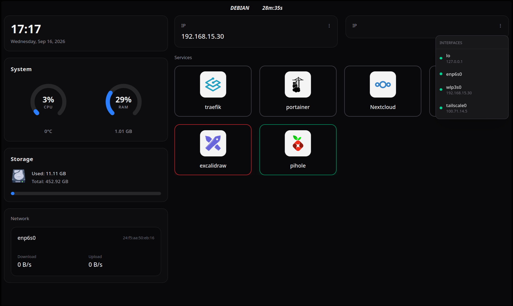

# Seabian Dashboard

A web dashboard for my homelab server, built **almost entirely with Go**. This project was created primarily for studying HTTP and learning how to build modern web applications with **HTMX** and **Tailwind CSS**.

## Dependencies
- [Mattix-agent](https://github.com/Mattix-Monitoring/Mattix-agent)
- [Air](https://github.com/air-verse/air) just for dev.
- Go
- Nodejs/Npm

## Features

- System resource monitoring
- CPU and RAM usage
- Storage information
- Docker container monitoring
- Automatic service health status
- HTMX-powered live updates

## Development
If you want development the project, you need **air** in your machine:
```bash
go install github.com/air-verse/air@latest
```
After your can run:
```bash
make dev
```

For build code, you can run:
```bash
make build
```

For more informations check the makefile!

## Project Structure

| Directory | Description |
|---|---|
| `web/` | Web parts, handlers components and more |
| `components/` | UI components built with templ |
| `handlers/` | HTTP request handlers |
| `models/` | Application data structures |
| `utils/` | Utils functions |
| `static/` | CSS, JavaScript, and other static assets |

## Docker

Seabian Dashboard can be run using Docker Compose.

The dashboard uses:

* **Mattix-agent** to collect system metrics.
* **Docker socket** to monitor Docker containers.
* `host.docker.internal` to communicate with services running on the host machine.

### Requirements

Before starting the dashboard, make sure **Mattix-agent** is running on the host and listening on port `7676`.

### Running with Docker Compose

Clone the repository and start the container:

```bash
docker compose up -d --build
```

The dashboard will be available at:

```text
http://localhost:8089
```

### Configuration

The default `compose.yml` uses the following configuration:

```yaml
services:
  dashboard:
    build:
      context: .
      dockerfile: Dockerfile

    container_name: seabian-dashboard

    ports:
      - "8089:8080"

    extra_hosts:
      - "host.docker.internal:host-gateway"

    environment:
      PORT: "8080"
      API_METRICS_URL: "http://host.docker.internal:7676/metrics"

    volumes:
      - /var/run/docker.sock:/var/run/docker.sock

    restart: unless-stopped
```

The application listens on port `8080` inside the container, which is exposed as port `8089` on the host.

`API_METRICS_URL` points to the Mattix-agent API running on the Docker host.

The Docker socket is mounted into the container so the dashboard can retrieve information about the Docker containers running on the host.

### Stop the Dashboard

```bash
docker compose down
```

To rebuild the image after making changes:

```bash
docker compose up -d --build
```

### Docker Labels

Seabian Dashboard uses Docker labels to define which containers should appear on the dashboard and how they should be displayed.

The following labels are currently supported:

| Label              | Description                                                   |
| ------------------ | ------------------------------------------------------------- |
| `dashboard.enable` | Defines whether the container should appear on the dashboard. |
| `dashboard.link`   | URL opened when the service is selected.                      |
| `dashboard.icon`   | URL of the icon displayed for the service.                    |

### Example

```yaml
labels:
  - "dashboard.enable=true"
  - "dashboard.link=http://pihole.seabian"
  - "dashboard.icon=https://cdn.jsdelivr.net/gh/homarr-labs/dashboard-icons/svg/pi-hole.svg"
```

Only containers with `dashboard.enable=true` are displayed by the dashboard.

The labels are read directly from the Docker container, allowing each service to define its own dashboard configuration without requiring changes to the Seabian Dashboard source code.

## Dashboard



Containers colors:
- RED = unhealthy
- YELLOW = starting
- GREEN = healthy
- GRAY = none 

<details> <summary>Development To-Do</summary>

- [X] Design layout

- [X] Fetch metrics from Mattix-agent

- [X] Create system components

- [X] Create service monitoring using the Docker socket

- [X] Add HTMX to components

- [X] Style the dashboard

</details>
